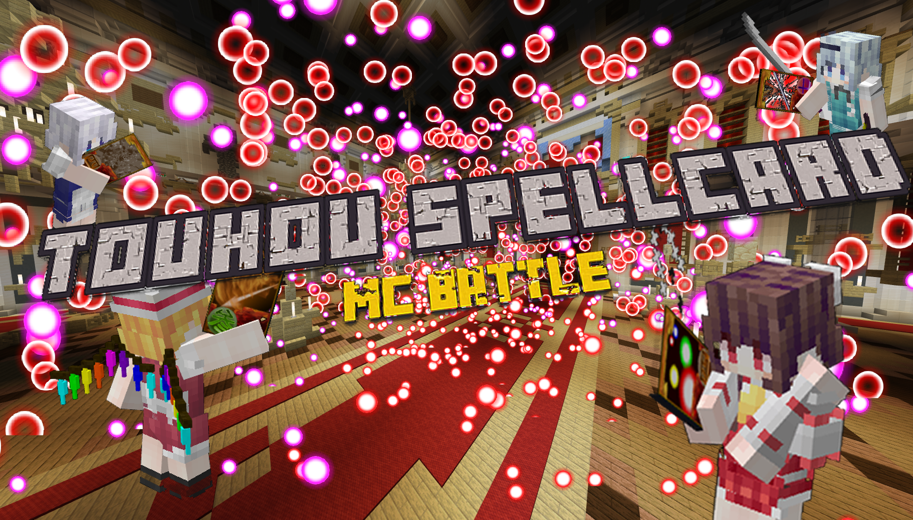

---
hide:
  - path
  - navigation
  - toc
---

<strong>

欢迎来到 东方符卡战争

</strong>

  
     服务器主打玩法【东方符卡战争】，是以东方project为为自主设计创作的东方project二次创作休闲竞技类地图，玩法相当于ACT游戏。
玩家可自由选择东方人物、选择花样繁多的符卡搭配卡组与其他玩家展开竞技战斗。截止2024年3月，地图内共开放有95+10名东方角色、近八百张符卡技能，
经过约三年半的开放测试与平衡性调整趋于稳定，富有竞技性。每年会举办两次大型赛事，优胜者可获取大量奖励。赛事已成功举办8届，
是服务器最重要的活动，由数十人参与竞赛互相切磋一较高下。

