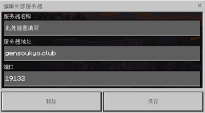

## 下载客户端文件
### 方法一（Android用户）
在群内寻找共存版客户端安装包下载。另可在[我的世界国际版全版本下载](https://mcapks.com/)自行寻找下载对应的客户端登录。切换客户端版本时注意备份相关文件，以免存档丢失。
### 方法二（win10/11 pc）
可下载群文件中的客户端运行环境后再下载群文件中的版本管理器下载对应版本的客户端。此外UWP安装包可前往[Minecraft for Windows 版本库](https://mcappx.com)寻找对应版本下载。
???+ info "如何为win10/11计算机安装适用于服务器的客户端"
    第一步：检查你的计算机系统，需要系统版本不低于Windows10/11 20h1<br>
    第二步：下载、解压、安装群文件中的 “安装运行客户端所需要的环境包.zip”<br>
    第三步：下载并解压群文件中的“客户端启动器.zip”，下载并解压群文件中的“Minecraft UWP_1.20.1501.0_x64.zip”，打开微软商店，关闭商店中的自动更新选项<br>
    第亖步：保持微软商店处于打开状态，保持客户端启动器处于打开状态，安装客户端文件Minecraft UWP_1.20.1501.0_x64<br>
    <br>
    完成以上操作后，通过客户端启动器即可在你的计算机上同时运行多个不同版本的Minecraft for UWP副本，通过启动器以启动运行并对它们进行管理、<br>
    当你需要安装其他版本的副本时，请确保你的安装过程操作如同以上第亖步 所示
### 关于apple用户
在应用商店内自行寻找下载，需关闭自动更新。<br>
??? warning "过期的信息"
    当前版本可前往[www.123pan.com/s/N6mrVv-fMY23.html](https://www.123pan.com/s/N6mrVv-fMY23.html)处下载。（此下载链接仅提供ipa安装包，你需要自行寻找方法以绕过iOS应用商店）<br>
欢迎apple设备用户提供你的适用于服务器的客户端安装方法供大家参考使用<br>

    
## 注册账号及添加服务器
注册登录账号：请确保您拥有微软账号且登录至Minecraft。登录状态正常时，您的游戏开始界面的右侧会显示玩家id以及角色皮肤预览模型。未登录请按游戏内引导注册或登录账号。<br>
添加服务器操作：<br>
1.点击游戏开始界面【游戏按钮】。<br>
2.选择【服务器】一栏。<br>
3.点击【添加服务器】，并填写服务器ip端口等信息。<br>

???+ note "复制服务器信息" 
    ``` py title="服务器地址"
    gensoukyo.club
    ```
    ``` py title="服务器端口"
    19132
    ```
## 通行证等级

&nbsp;&nbsp;&nbsp;&nbsp;&nbsp;&nbsp;&nbsp;&nbsp;为保证相关玩法的玩家综合素质与服务器安全，服务器设定有通行证等级划分，不同等级的玩家仅有是否能够加入其他服务器玩法的权限区分。
所有玩家在无违规的前提下均默认具有0级通行证，在游玩任意端口并记录下玩家id后即可获得1级通行证。玩家可通过累计游玩时长/邀请其他玩家/参与游戏反馈等各类活跃方式累计获取更高的通行证等级。
<br>
<br>
<br>
<br>