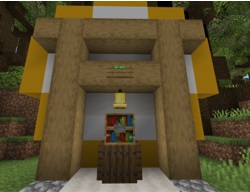
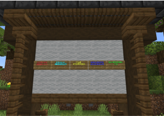
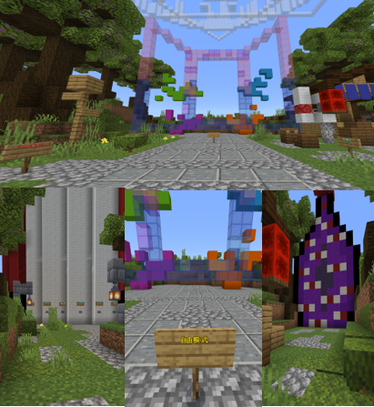

## 东方符卡战争 

> 端口：19136，通行证等级：0

&nbsp;&nbsp;&nbsp;&nbsp;&nbsp;&nbsp;&nbsp;&nbsp;该玩法为服务器主打玩法，是以东方project为为自主设计创作的东方project二次创作休闲竞技类地图，玩法相当于ACT游戏。玩家可自由选择东方人物、选择花样繁多的符卡搭配卡组与其他玩家展开竞技战斗。截止2023年底，地图内共开放有93名东方角色、近八百张符卡技能，经过约四年的开放测试与平衡性调整趋于稳定，富有竞技性。对东方project不了解的玩家可以当做一种与原版pvp全然不同的职业战争类小游戏游玩。
???+ note "内容预览"
    ??? note "新手教程"
        { align=left }
        进入服务器后左手侧为新手教程，玩家可由此快速了解玩法，并了解相关设定。
    ??? note "公告版"
        { align=left }
        进入服务器后右手侧为公告版，玩家可由此了解地图相关信息或特定操作方式（如回城）。
        
    ??? note "新手教程"
        { align=left }
        地图正前方鸟居后三条岔路自左到右分别为匹配模式/自由模式/娱乐模式，正常游玩可直接自由模式或在匹配模式中选择练习模式。体验其他玩法可自由选择其他模式。由于地图主打pvp玩法，因此在玩家较少时可通过交流群邀请其他玩家一同游玩，或是体验其他pve玩法。
     
## 世界生存服玩法

> 端口：19132，通行证等级：2 

&nbsp;&nbsp;&nbsp;&nbsp;&nbsp;&nbsp;&nbsp;&nbsp;世界服意图模拟真实世界运营，设有阵营、经济、工业、农业、交通、环境、文化等拓展概念。由于审核较为严格、筛选的玩家素质普遍较高，服务器内的氛围非常适合长期建设或养成类玩家进行城市建设、小镇规划或者培养势力进行小队合作等。世界服内会支持玩家积极建设并提供工程队服务。除此以外，玩家参与活动获取的奖章、纪念章均会在本服发放。
!!! warning "警告"
    本服不等同于传统生存服，不等同于社会模拟玩法，在休闲生存服的基础上限制或禁止玩家的开采、跑图、生电、打地洞等行为，介意者慎入。

## 休闲生存服玩法

> 端口：19140，通行证等级：0 

&nbsp;&nbsp;&nbsp;&nbsp;&nbsp;&nbsp;&nbsp;&nbsp;休闲生存服定义上为世界生存服的扩展，主要用于为世界服玩家补充矿物建材等原材料获取途径，适合休闲、交友或普通生存玩家，玩法偏向于纯生存。
相对世界服限制小，但由于门槛的放低环境会略逊于世界服。设置有跑图限制。
!!! warning "警告"
    本服不等同于纯净生存服，禁止大规模生电以及一切故意损害其他玩家利益的行为。

## 人偶战争玩法

> 端口：19144，通行证等级：0 

&nbsp;&nbsp;&nbsp;&nbsp;&nbsp;&nbsp;&nbsp;&nbsp;人偶战争为基于东方project中的人偶使形象创作的即时战略类小游戏。玩家需要根据环境、战局选择进行发展、进攻，甚至在多人对战中进行外交、联合，通过不断部署人偶的方式最终击杀对手人偶师来获得胜利。
!!! abstract "说明"
    当前该玩法地图尚未完工，但可进行简单游玩并设置有pvp/pve地图，玩家可前往地图内自行探索玩法，此处不再过多描述。

## 幻想乡RPG建设

> 通行证等级：暂不开放

待建设的Minecraft幻想乡还原及相关的角色扮演类玩法开发项目，当前处于初期准备阶段。有建筑才能/模组开发/美术创作的玩家欢迎加入到我们的项目中。
!!! abstract "说明"
    该项目暂不开放，具体动态请参考群公告等消息。

## 其他活动玩法
服务器会不定时开放一些自研/转载小游戏游玩，例如现代战争、球赛、枪战、赛车等，还会开放一些解谜、摄影、通识竞赛等多种文化活动。 
玩家可自由选择参与其中赢取奖章。具体开放时间请参考群公告。
 
 
 
 
 
 
 
 
